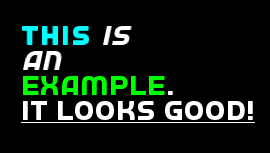

# RichText
A lighter version of this library:
https://github.com/skyrpex/RichText

Example:

  

```C++
#include <SFML/Graphics.hpp>
#include "RichText.hpp"
int main()
{
    sf::RenderWindow window(sf::VideoMode(800, 600), "sfe::RichText");
    window.setFramerateLimit(30);

    sf::Font font;
    font.loadFromFile("font.ttf");

    Rich::Text text;

    text.setFont(font);
    text.setCharacterSize(25);
    text.setPosition(400, 300);

    text << sf::Text::Bold << sf::Color::Cyan << "This "
        << sf::Text::Italic << sf::Color::White << "is\nan\n"
        << sf::Text::Regular << sf::Color::Green << "example"
        << sf::Color::White << ".\n"
        << sf::Text::Underlined << "It looks good!";

    while (window.isOpen())
    {
        sf::Event event;
        while (window.pollEvent(event))
        {
            if (event.type == sf::Event::Closed)
                window.close();

            
        }
        window.clear();
        window.draw(text);
        window.display();
    }
}
```
